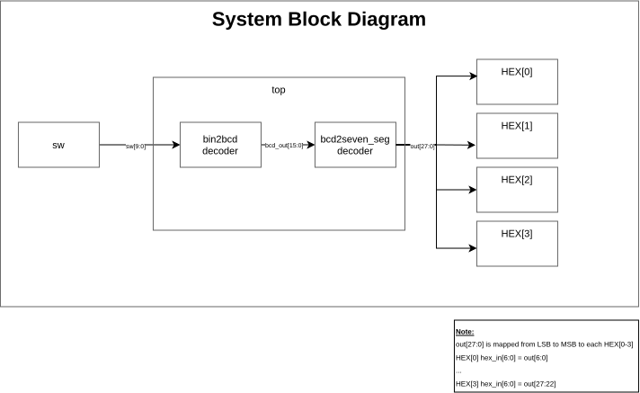

# LECCION6 Simulation TBs

AI usage disclaimer: This README and the related project documentation were created or assisted using AI tooling. The content was reviewed and adapted to match the project workflow and toolchain referenced in the Makefile and source files.

## Table of Contents

- [Overview](#overview)
- [System Block Diagram](#system-block-diagram)
- [Project Structure](#project-structure)
- [Prerequisites](#prerequisites)
- [Workflows](#workflows)
  - [1) RTL Simulation](#1-rtl-simulation)
  - [2) Synthesis with Yosys](#2-synthesis-with-yosys)
  - [3) Linting with Verible](#3-linting-with-verible)
  - [4) Quartus Build and Netlist](#4-quartus-build-and-generated-netlist)
  - [5) GLS / Post-fit Simulation](#5-gls--post-fit-simulation)
  - [6) Top-level Project Usage](#6-top-level-project-usage)
- [Why GLS is More Complicated](#why-the-gls-flow-is-more-complicated)
- [Working with Generated Files](#5-working-with-generated-files)
- [Local README Index](#6-local-readme-index)
- [References](#7-references-and-source-material)
- [Recommended Workflow](#8-recommended-workflow)
- [Repository Hygiene](#repo-hygiene-notes)

## Overview

This repository includes a small FPGA-style design with a comprehensive verification and development toolchain:

- **RTL functional simulation** in Questa
- **Synthesis flow** using Yosys (open-source synthesis)
- **Linting and code analysis** with Verible (SystemVerilog linter)
- **Quartus project build** and netlist generation
- **Optional post-fit / GLS simulation** using the generated netlist and delay data

The purpose is to keep the design source clean, while separating local generated artifacts from the committed project files.

## System Block Diagram

This is a very simplified diagram of the system, switches[9:0] as inputs and output gets displayed in seven segments displays (HEX[3:0])



## Project Structure

- [blocks/README.md](blocks/README.md) : RTL block overview
- [pkg/README.md](pkg/README.md) : shared package definitions
- [top/README.md](top/README.md) : top-level design overview
- [tb/README.md](tb/README.md) : testbench directory guide
- [quartus/README.md](quartus/README.md) : Quartus project build and programming flow
- [synth/README.md](synth/README.md) : Yosys synthesis workflow
- [lint/README.md](lint/README.md) : Verible lint and waiver setup

## Prerequisites

This project is specific to the Terasic Cyclone V board with the following device mapping in the Quartus project:

- Family: Cyclone V
- Device: 5CGXFC5C6F27C7
- Board: Terasic Cyclone V development board
- Reference: https://www.terasic.com.tw/cgi-bin/page/archive.pl?Language=English&CategoryNo=165&No=830

The expected toolchain is:

- Intel Quartus Prime Lite / Standard with Cyclone V support
- Questa Intel FPGA Edition (or compatible ModelSim/Questa simulator)
- Yosys from the OSS CAD Suite build
- Verible SystemVerilog linter
- make
- Git
- optionally: Graphviz and SVG viewer tools such as Inkscape or xdot

Important: this is not a generic FPGA project. The pin assignments and device IDs are tied to the board family and part number above, so the design is expected to run on this specific hardware and not be easily portable to other boards without modifying pin assignments and device settings.

## Workflows

### 1) RTL Simulation

This is the normal development loop. It checks logical behavior without involving FPGA primitives or post-fit timing.

From the relevant testbench folder, for example:

```bash
cd tb/bin2bcd
make run
```

Common targets:

```bash
make run
make debug
make run_debug
make clean
```

What these do:

- `make run` : compile the RTL and run in batch mode
- `make debug` : open a GUI debug session
- `make run_debug` : GUI session with `run -all`
- `make clean` : remove `work/` and log files

This is the fastest path for catching logic bugs while developing the RTL.

### 2) Synthesis with Yosys

The Yosys synthesis flow provides an open-source alternative for netlist generation and analysis, independent of Quartus.

From the synthesis folder:

```bash
cd synth
make
```

This generates:

- Post-synthesis netlist
- Resource utilization reports
- Timing analysis (when timing constraints are applied)

Benefits:

- Fast synthesis turnaround for design iteration
- Open-source toolchain (no proprietary software required)
- Direct control over synthesis options and strategies
- Useful for design exploration and optimization

See [synth/README.md](synth/README.md) for detailed setup and usage.

### 3) Linting with Verible

Code quality and style checking using the Verible SystemVerilog linter.

From the lint folder:

```bash
cd lint
make lint
```

This:

- Checks all RTL files for syntax, style, and naming conventions
- Applies project-specific rules via `custom_rules_verible_lint.txt`
- Suppresses intentional exceptions via `waivers.txt`
- Captures results to `verible_lint.log`

Benefits:

- Catches style issues early in development
- Enforces consistent naming and code structure
- Non-invasive (does not require compilation or simulation)
- Easily integrated into CI/CD pipelines

See [lint/README.md](lint/README.md) for rule configuration and waiver examples.

### 4) Quartus Build and Generated Netlist

The FPGA build is separate from the RTL simulation. Quartus generates post-fit outputs used for timing-aware checking.

From the Quartus folder:

```bash
cd quartus
make all
```

This creates the project outputs, including the generated netlist and post-fit files under:

```text
quartus/simulation/questa/
```

Typical output you may see there:

- `top.svo` : post-fit netlist
- `top.sft` : Quartus-generated settings file, not a true SDF delay file
- additional generated project artifacts in `output_files/` and `db/`

Important: `top.sft` is not the file you pass to `-sdftyp` in Questa. It is a Quartus metadata/settings file, not a timing delay file. The real delay file must be a `.sdo` or `.sdf` generated for the specific compilation output, and Quartus does not always provide this in Lite editions.

### 5) GLS / Post-fit Simulation

This is a different flow from plain RTL simulation. It loads the FPGA netlist and optionally applies delay information.

The correct flow is:

1. Build the Quartus project
2. Compile the Intel/Quartus simulation library into the Questa work library
3. Compile the generated post-fit netlist
4. Run the testbench with `-sdftyp` only if a real delay file exists

The key idea is that the generated netlist references FPGA primitive modules such as:

- `cyclonev_lcell_comb`
- other Intel primitive definitions

Those modules are not part of the normal RTL simulation library. They only exist in the Quartus simulation library, so you must compile them first.

A Quartus GUI based tutorial can be found here https://www.youtube.com/watch?v=YSQnVqXt3do

### 6) Top-level Project Usage

From the top-level TB folder:

```bash
cd tb/top
make run
make debug
make run_debug
make gls
make gui_gls
```

Meaning:

- `make run` : RTL verification of the full top-level design
- `make debug` : GUI debug for RTL
- `make run_debug` : GUI debug plus auto-run
- `make gls` : post-fit netlist flow when Quartus output exists
- `make gui_gls` : interactive post-fit GUI flow

## Why the GLS Flow is More Complicated

This part often feels confusing because it mixes three layers:

1. your RTL source
2. Quartus-generated FPGA netlist
3. Intel primitive simulation library

A plain RTL simulation does not need the FPGA library. A post-fit simulation does. That is why you may see errors like:

```text
Module 'cyclonev_lcell_comb' is not defined
```

This means the generated netlist was loaded, but the corresponding Quartus primitive library was not compiled into the Questa work library.

## 5) Working with Generated Files

Generated files such as:

- `work/`
- `transcript`
- `transcript.log`
- `*.wlf`
- `*.vcd`
- Quartus output folders

should not be committed to source control. The repository uses `.gitignore` to keep the source tree clean and focused on actual design files.

## 6) Local README Index

Use these project-local guides for more detailed instructions:

- [tb/top/README.md](tb/top/README.md) : top-level testbench and simulation flow
- [tb/bin2bcd/README.md](tb/bin2bcd/README.md) : binary-to-BCD verification flow
- [tb/bcd2seven_seg/README.md](tb/bcd2seven_seg/README.md) : 7-segment decoder validation flow
- [quartus/README.md](quartus/README.md) : Quartus build and programming flow
- [synth/README.md](synth/README.md) : Yosys and synthesis workflow
- [lint/README.md](lint/README.md) : Verible linting and waiver setup

## 7) References and Source Material

This documentation is based on the actual project files in the repository, especially:

- [quartus/top.qsf](quartus/top.qsf) : Quartus project configuration and source list
- [quartus/top.sdc](quartus/top.sdc) : timing constraints used by the FPGA project
- [top/top.sv](top/top.sv) : top-level design under test
- [tb/top/Makefile](tb/top/Makefile) : RTL and GLS simulation flow
- [tb/top/top_tb.sv](tb/top/top_tb.sv) : top-level verification testbench
- [tb/bcd2seven_seg/bcd2seven_seg_tb.sv](tb/bcd2seven_seg/bcd2seven_seg_tb.sv) : 7-segment decoder checks
- [tb/bin2bcd/bin2bcd_dual_tb.sv](tb/bin2bcd/bin2bcd_dual_tb.sv) : decoder comparison testbench

## 8) Recommended Workflow

For day-to-day development:

```bash
cd tb/top
make run
```

To check code quality with linting:

```bash
cd lint
make lint
```

For synthesis exploration:

```bash
cd synth
make
```

When you want to check the FPGA timing view:

```bash
cd quartus
make all
cd ../tb/top
make gls
```

If the post-fit delay file is not present, the GLS flow should degrade gracefully and still run the post-fit netlist without SDF rather than failing on a bogus file.

## Repo Hygiene Notes

- Keep source files in the repo
- Keep generated artifacts local
- Do not commit Quartus build outputs or simulation artifacts
- Treat `top.sft` as a Quartus metadata file, not as a Questa SDF input
- Run lint checks before committing to catch style issues early

This keeps the project reproducible and avoids cluttering the repository with generated output.
